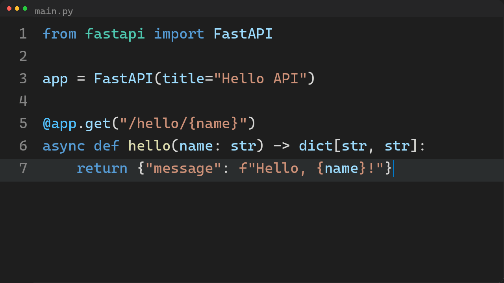
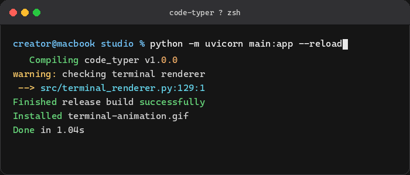
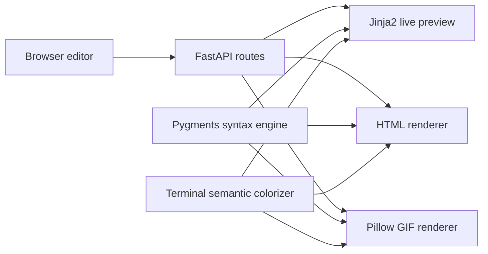

# Code Typer Studio

Code Typer Studio is a FastAPI web application for creating polished code-typing and terminal animations directly in the browser. It combines a configurable code editor, syntax-aware rendering, a macOS-style terminal simulator, live previews, and downloadable GIF or HTML output in one lightweight project.

The application contains two focused tools:

- **Code Studio** turns source code into a syntax-highlighted typing animation.
- **Terminal Studio** animates a command word by word, waits one second, and displays colorized terminal output at once.

> Terminal Studio is a visual simulator. It never executes the commands entered by the user.

## Screenshots

### Code Studio

Code Studio supports language-aware highlighting, file icons, multiple themes, configurable typing modes, line numbers, window chrome, cursor styles, playback controls, and common output dimensions.



### Terminal Studio

Terminal Studio recreates a macOS Terminal window at a fixed 700×300 export size. Commands are typed word by word, followed by a one-second pause and immediate output. Errors, warnings, success messages, paths, strings, diagnostics, and ANSI colors receive terminal-style coloring.



## Features

### Code animation

- Live typing preview with restart and playback controls
- Character, word, and line typing modes
- Syntax highlighting powered by Pygments
- Built-in samples and a broad programming-language catalog
- Automatic language and file-icon selection from the filename
- Multiple editor themes and monospaced font choices
- Adjustable typing speed, line pause, start delay, font size, and line height
- Configurable line numbers, window chrome, autoplay, loop, cursor style, and frame size
- Presets for 700×300, 16:9, 9:16, 1:1, 4:5, and 4:3 output
- Standalone HTML, animated GIF, and reusable project JSON exports

### Terminal animation

- macOS-style title bar, traffic-light controls, prompt, command, cursor, and output
- Editable window title, prompt, command, and output
- Word-by-word command typing with adjustable speed
- Fixed one-second delay before output appears
- Semantic colors for errors, warnings, successful operations, paths, strings, numbers, and diagnostic markers
- Support for standard ANSI foreground colors in pasted output
- Optional looping
- Standalone HTML and exact 700×300 animated GIF exports

## How It Works



1. The browser collects the selected code or terminal settings.
2. HTMX sends editor changes to a FastAPI preview endpoint without reloading the page.
3. The HTML renderer builds an isolated animation inside an iframe.
4. Export endpoints use the same settings to generate standalone HTML, JSON, or GIF files.
5. Pillow renders GIF frames server-side, so exported animations do not require a browser recording step.

## Technology Stack

| Technology | Purpose |
| --- | --- |
| **Python** | Application language and rendering logic |
| **FastAPI** | Web routes, form processing, and download responses |
| **Uvicorn** | ASGI development and production server |
| **Jinja2** | Server-rendered pages and iframe preview templates |
| **HTMX** | Live preview updates without a frontend framework |
| **Tailwind CSS** | Responsive layout and interface styling |
| **CodeMirror 5** | Browser-based source-code editor |
| **Pygments** | Language detection support and syntax token colors |
| **Pillow** | Server-side animated GIF and screenshot rendering |
| **Vanilla JavaScript** | Typing timelines, controls, custom selects, and terminal playback |

## Run Locally

### 1. Clone the repository

```bash
git clone git@github.com:BlackCobra29-bit/Code-Typer-Studio.git
cd Code-Typer-Studio
```

### 2. Create a virtual environment

Windows PowerShell:

```powershell
py -m venv .venv
.\.venv\Scripts\Activate.ps1
```

macOS or Linux:

```bash
python3 -m venv .venv
source .venv/bin/activate
```

### 3. Install dependencies

```bash
pip install -r requirements.txt
```

### 4. Start the application

```bash
uvicorn main:app --reload
```

Open these pages:

- Code Studio: [http://127.0.0.1:8000](http://127.0.0.1:8000)
- Terminal Studio: [http://127.0.0.1:8000/terminal](http://127.0.0.1:8000/terminal)

## Using Code Studio

1. Select a sample or paste source code into the editor.
2. Choose the language, theme, filename, typing mode, speed, and frame size.
3. Review the live preview and use **Restart** to replay it.
4. Export the result as HTML, GIF, or project JSON.

## Using Terminal Studio

1. Open `/terminal` from the navigation.
2. Set the terminal title and prompt.
3. Enter the command to animate and the output to display.
4. Adjust the word speed and enable looping when needed.
5. Export the animation as standalone HTML or a 700×300 GIF.

Terminal output can be plain text or contain ANSI foreground sequences. Plain text is colorized automatically from recognizable message types; explicit ANSI colors take priority when present.

## Application Routes

| Method | Route | Description |
| --- | --- | --- |
| `GET` | `/` | Code Studio page |
| `POST` | `/preview` | Refresh the code animation preview |
| `POST` | `/download/html` | Export a standalone code animation |
| `POST` | `/download/gif` | Export an animated code GIF |
| `POST` | `/download/project` | Export code settings as JSON |
| `GET` | `/terminal` | Terminal Studio page |
| `POST` | `/terminal/preview` | Refresh the terminal animation preview |
| `POST` | `/terminal/download/html` | Export a standalone terminal animation |
| `POST` | `/terminal/download/gif` | Export a 700×300 terminal GIF |

## Project Structure

```text
.
|-- main.py                       # FastAPI application and routes
|-- requirements.txt              # Python dependencies
|-- README.md
|-- docs/
|   `-- images/                    # README screenshots
|-- src/
|   |-- gif_exporter.py            # Code animation GIF renderer
|   |-- languages.py               # Language metadata and icon mappings
|   |-- renderer.py                # Code animation HTML renderer
|   |-- samples.py                 # Built-in code examples
|   |-- syntax_style.py            # Shared syntax color helpers
|   |-- terminal_renderer.py       # Terminal HTML/GIF renderer and colorizer
|   `-- themes.py                  # Editor theme definitions
|-- static/
|   |-- app.js                     # Code Studio interactions
|   |-- terminal.js                # Terminal Studio interactions
|   `-- icons/                     # Language and file icons
`-- templates/
    |-- index.html                 # Code Studio page
    |-- terminal.html              # Terminal Studio page
    |-- _preview.html              # Code preview iframe
    `-- _terminal_preview.html     # Terminal preview iframe
```

## Export Formats

- **HTML:** A standalone page containing the animation styles and playback logic.
- **GIF:** A server-rendered animated image suitable for documentation, social posts, and presentations.
- **Project JSON:** Code Studio content and settings for reuse or version control.

## Author

Developed by [tesfahiwet truneh](https://www.linkedin.com/in/%F0%90%A9%A9%F0%90%A9%AA%F0%90%A9%B0%F0%90%A9%A2%F0%90%A9%BA%F0%90%A9%A5%F0%90%A9%A9-%F0%90%A9%A9%F0%90%A9%A7%F0%90%A9%A5%F0%90%A9%AC%F0%90%A9%A0-2a2139179/).
