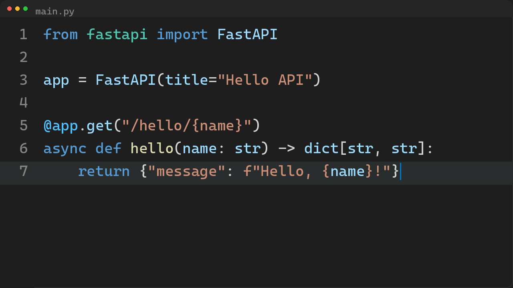
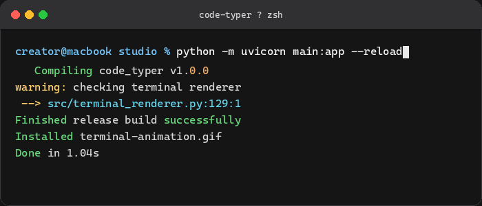
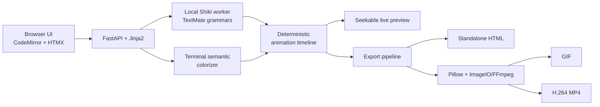

<p align="center">
  
</p>

<h1 align="center">Coduxum</h1>

<p align="center">
  <strong>Make code worth watching.</strong><br>
  A browser-based motion studio for polished code typing, diffs, guided walkthroughs, and terminal animations.
</p>

<p align="center">
  
  
  
  
  
</p>

<p align="center">
  <a href="#features">Features</a> ·
  <a href="#quick-start">Quick start</a> ·
  <a href="#studio-guide">Studio guide</a> ·
  <a href="#export-formats">Exports</a> ·
  <a href="#architecture">Architecture</a> ·
  <a href="#testing">Testing</a>
</p>

---

Coduxum turns source code and terminal sessions into presentation-ready motion assets—without a video editor or a hand-built animation timeline. Paste your content, choose the visual treatment and timing, preview the result, then export it for tutorials, documentation, product demos, courses, or social media.

The editor experience is browser-based. Syntax highlighting, animation timing, and media rendering run on the application host; source code is never sent to a third-party highlighting service.

> [!IMPORTANT]
> Terminal Studio is a visual simulator. It displays the command and output you provide, but it never executes commands.

## At a glance

| | |
| --- | --- |
| **4 focused studios** | Code Typer, Code Diff, Code Scroll, and Terminal Studio |
| **52 languages** | Automatic detection plus explicit language selection |
| **18 editor themes** | Original Shiki/TextMate token colors and font styles |
| **12 canvas gradients** | Reusable backgrounds across the studio suite |
| **4 export types** | Standalone HTML, MP4, GIF, and reusable project JSON |
| **Deterministic motion** | Seekable timelines shared by previews and exports |

## Preview

| Code Typer | Terminal Studio |
| :---: | :---: |
|  |  |

## Features

### Four purpose-built studios

| Studio | Best for | Motion model | Exports |
| --- | --- | --- | --- |
| **Code Typer** | Introductions, tutorials, and code reveals | Character, syntax-token, word, or line typing | HTML, MP4, GIF, JSON |
| **Code Diff** | Refactors, fixes, and before/after explanations | Removed, inserted, replaced, and resolved lines | HTML, MP4, GIF, JSON |
| **Code Scroll** | Long-file walkthroughs and guided focus | Smooth travel to a selected line or range | HTML, MP4, GIF, JSON |
| **Terminal Studio** | CLI demos, build output, and release sequences | Word-by-word commands followed by semantic output | HTML, MP4, GIF |

### Accurate code presentation

- Shiki and TextMate grammars process the complete source before animation.
- Theme-native colors and bold, italic, and underline styles carry through to the editor, HTML, GIF, and MP4 output.
- Filename detection takes priority over source guessing; explicit language choices always win.
- Multiline source, Unicode, indentation, blank lines, and whitespace are preserved.
- Unsupported languages fall back to plain text instead of an invented color palette.
- JetBrains Mono regular, bold, italic, and bold italic are bundled for consistent rendering.

### Motion and design controls

- Live, seekable previews with replay, pause, and timeline scrubbing.
- Adjustable speed, line pauses, opening delay, focus timing, typography, and canvas padding.
- Optional line numbers, editor chrome, autoplay, looping, and cursor styles.
- Plain or gradient canvases with twelve included presets.
- Consistent landscape and square formats for code scenes.
- Display, landscape, portrait, square, 4:5, and 4:3 formats for terminal scenes.

### App experience

- Responsive interface for desktop and mobile.
- HTMX page transitions without full document reloads.
- Preserved browser history, URLs, loading feedback, and focus behavior.
- Shared visual controls across all studios.
- Standalone exports that do not include playback controls.

## Quick start

### Prerequisites

- [Python](https://www.python.org/downloads/) 3.10 or newer
- [Node.js](https://nodejs.org/) 20 or newer
- Git

Node.js powers the local Shiki worker. MP4 rendering uses the FFmpeg binary provided through `imageio-ffmpeg`.

### 1. Clone the repository

```bash
git clone https://github.com/BlackCobra29-bit/Code-Typer-Studio.git
cd Code-Typer-Studio
```

### 2. Create and activate a Python environment

Windows PowerShell:

```powershell
py -m venv .venv
.\.venv\Scripts\Activate.ps1
```

macOS or Linux:

```bash
python3 -m venv .venv
source .venv/bin/activate
```

### 3. Install dependencies

```bash
python -m pip install --upgrade pip
pip install -r requirements.txt
npm ci
```

Shiki is pinned through `package-lock.json`, so every supported grammar and theme resolves consistently.

### 4. Run Coduxum

```bash
python -m uvicorn main:app --reload
```

Open [http://127.0.0.1:8000](http://127.0.0.1:8000).

| Studio | Local URL |
| --- | --- |
| Home | [http://127.0.0.1:8000](http://127.0.0.1:8000) |
| Code Typer | [http://127.0.0.1:8000/code-typer](http://127.0.0.1:8000/code-typer) |
| Code Diff | [http://127.0.0.1:8000/code-diff](http://127.0.0.1:8000/code-diff) |
| Code Scroll | [http://127.0.0.1:8000/code-scroll](http://127.0.0.1:8000/code-scroll) |
| Terminal Studio | [http://127.0.0.1:8000/terminal](http://127.0.0.1:8000/terminal) |

## Studio guide

### Code Typer

1. Select a built-in sample or paste source into the editor.
2. Choose a language, theme, filename, and typing mode.
3. Tune the speed, pauses, typography, cursor, frame, and canvas.
4. Replay or scrub the preview.
5. Export HTML, MP4, GIF, or project JSON.

### Code Diff

1. Paste the original and updated versions of the source.
2. Select the language and editor theme.
3. Tune removal, insertion, movement, and resolved-state timing.
4. Review the animated transition from before to after.
5. Export HTML, MP4, GIF, or project JSON.

### Code Scroll

1. Paste a long source file.
2. Choose the first and last lines that should receive focus.
3. Adjust travel time, focus hold, typography, and frame styling.
4. Replay or scrub the centered focus animation.
5. Export HTML, MP4, GIF, or project JSON.

### Terminal Studio

1. Set the window title and prompt.
2. Enter the command to animate and the output to reveal.
3. Choose word speed, canvas treatment, frame size, and looping.
4. Preview the typed command and colorized output.
5. Export HTML, MP4, or GIF.

Terminal output may be plain text or contain ANSI foreground sequences. Plain output is colored from recognizable errors, warnings, success messages, paths, strings, numbers, and diagnostics. Explicit ANSI colors take priority.

## Export formats

| Format | Available in | Notes |
| --- | --- | --- |
| **HTML** | All studios | Self-contained animation with inline styles and playback logic; Code Typer embeds JetBrains Mono; no duration limit |
| **MP4** | All studios | H.264 video for editors and publishing workflows; code scenes render at 60 fps |
| **GIF** | All studios | Shareable animated image; code scenes render at 20 fps and fit within 700 × 700 px |
| **Project JSON** | Code Typer, Code Diff, Code Scroll | Source content and scene configuration for reuse or version control |

### Frame sizes

Code Typer, Code Diff, and Code Scroll:

- `16:9` — 1280 × 720
- `1:1` — 1080 × 1080

Terminal Studio:

- `Display` — 700 × 300
- `16:9` — 1280 × 720
- `9:16` — 720 × 1280
- `1:1` — 1080 × 1080
- `4:5` — 1080 × 1350
- `4:3` — 1024 × 768

### Rendering limits

- Code input: 20,000 characters, 1,000 line breaks, and 2,000 characters per line.
- Code-scene MP4: up to 3 minutes.
- Code-scene GIF: up to 45 seconds.
- HTML: no animation-duration limit.
- Terminal input: up to 1,000 command characters and 6,000 output characters.

When an export exceeds a server-side limit, Coduxum returns a clear `422` response instead of silently truncating the scene.

## Architecture


```mermaid
flowchart LR
    UI["Browser UI<br>CodeMirror + HTMX"] --> API["FastAPI + Jinja2"]
    API --> SHIKI["Local Shiki worker<br>TextMate grammars"]
    API --> TERM["Terminal semantic<br>colorizer"]
    SHIKI --> TIME["Deterministic<br>animation timeline"]
    TERM --> TIME
    TIME --> PREVIEW["Seekable live preview"]
    TIME --> EXPORT["Export pipeline"]
    EXPORT --> HTML["Standalone HTML"]
    EXPORT --> MEDIA["Pillow + ImageIO/FFmpeg"]
    MEDIA --> GIF["GIF"]
    MEDIA --> MP4["H.264 MP4"]
```

### Rendering pipeline

1. FastAPI normalizes and validates the submitted scene settings.
2. The persistent Node.js worker highlights the complete source with Shiki.
3. Python carries exact token colors and font-style flags into a deterministic timeline.
4. The browser preview seeks that timeline with `requestAnimationFrame` acting only as its clock.
5. HTML exports package the scene into a standalone page.
6. GIF and MP4 exporters sample the same timeline server-side through Pillow and ImageIO/FFmpeg.

This design keeps the reveal order, scrolling, focus state, and cursor position reproducible at any timestamp. The preview and video exporters share colors and timing, although browser and Pillow font rasterization may produce small antialiasing differences.

## Project structure

```text
.
├── main.py                    # FastAPI application, routes, validation, and defaults
├── requirements.txt           # Python runtime dependencies
├── package.json               # Node.js metadata and Shiki dependency
├── package-lock.json          # Reproducible Node.js dependency lock
├── src/
│   ├── highlight.mjs          # Persistent local Shiki worker
│   ├── syntax_style.py        # Language detection and TextMate token bridge
│   ├── typing_timeline.py     # Deterministic code-reveal timing
│   ├── renderer.py            # Code Typer HTML and project exports
│   ├── gif_exporter.py        # Code Typer GIF and MP4 renderer
│   ├── diff_renderer.py       # Code Diff model, timeline, and HTML
│   ├── diff_exporter.py       # Code Diff GIF and MP4 renderer
│   ├── scroll_renderer.py     # Code Scroll model, timeline, and HTML
│   ├── scroll_exporter.py     # Code Scroll GIF and MP4 renderer
│   ├── terminal_renderer.py   # Terminal HTML, GIF, MP4, and colorization
│   ├── languages.py           # Language catalog and icon metadata
│   ├── themes.py              # Editor theme definitions
│   ├── gradients.py           # Canvas gradient catalog
│   └── samples.py             # Built-in examples
├── static/
│   ├── coduxum-logo.svg       # Coduxum brand mark and favicon
│   ├── app.js                 # Code Typer interactions
│   ├── diff_studio.js         # Code Diff interactions
│   ├── scroll_studio.js       # Code Scroll interactions
│   ├── terminal.js            # Terminal Studio interactions
│   ├── shared.js              # Navigation, modals, and shared lifecycle
│   ├── home.js                # Homepage scene demonstrations
│   ├── *.css                  # App, homepage, and rendered-frame styles
│   ├── fonts/                 # Bundled JetBrains Mono files and license
│   └── icons/                 # Language and file-type icons
├── templates/                 # Jinja2 pages, previews, navigation, and modals
├── tests/
│   └── test_code_studio.py    # Rendering, highlighting, timing, and route tests
└── docs/images/               # README screenshots
```

<details>
<summary><strong>Application routes</strong></summary>

| Method | Route | Purpose |
| --- | --- | --- |
| `GET` | `/` | Homepage and studio directory |
| `GET` | `/code-typer` | Code Typer interface |
| `POST` | `/highlight` | Resolve theme-native tokens for the editor |
| `POST` | `/preview` | Refresh the Code Typer preview |
| `POST` | `/download/{html,gif,mp4,project}` | Export a Code Typer scene |
| `GET` | `/code-diff` | Code Diff interface |
| `POST` | `/code-diff/preview` | Refresh the Code Diff preview |
| `POST` | `/code-diff/download/{html,gif,mp4,project}` | Export a Code Diff scene |
| `GET` | `/code-scroll` | Code Scroll interface |
| `POST` | `/code-scroll/preview` | Refresh the Code Scroll preview |
| `POST` | `/code-scroll/download/{html,gif,mp4,project}` | Export a Code Scroll scene |
| `GET` | `/terminal` | Terminal Studio interface |
| `POST` | `/terminal/preview` | Refresh the terminal preview |
| `POST` | `/terminal/download/{html,gif,mp4}` | Export a terminal scene |

</details>

## Privacy and safety

- Shiki grammars and themes run through the local Node.js worker; source is not uploaded to a highlighting API.
- Terminal Studio never starts a shell and never runs the displayed command.
- User content is escaped before HTML serialization.
- Export work is bounded by input and duration limits to protect server resources.
- The current interface loads Tailwind CSS, HTMX, and CodeMirror browser assets from public CDNs; the submitted source is not included in those asset requests.

## Testing

Run the complete test suite with Python's standard library:

```bash
python -m unittest discover -s tests -v
```

The suite covers:

- Real Dark+ and Dracula token colors
- Every offered language and theme
- Automatic detection and explicit overrides
- Multiline, Unicode, and whitespace preservation
- Safe HTML serialization
- Deterministic typing, diff, and scrolling timelines
- Preview/export theme and metric consistency
- Line-range focus behavior
- GIF loop behavior
- Studio routes and export wiring

## Troubleshooting

### Highlighting returns `503`

Confirm that Node.js 20+ is available and install the pinned dependencies again:

```bash
node --version
npm ci
```

Coduxum intentionally reports an unavailable highlighter instead of substituting approximate syntax colors.

### MP4 export fails

Reinstall the Python media dependencies and confirm that ImageIO can resolve its FFmpeg binary:

```bash
pip install --upgrade imageio imageio-ffmpeg
python -c "import imageio_ffmpeg; print(imageio_ffmpeg.get_ffmpeg_exe())"
```

### An export returns `422`

The scene exceeded a documented input or duration limit. Shorten the source, increase the animation speed, choose MP4 for longer scenes, or use HTML when no duration cap is appropriate.

## Contributing

Contributions are welcome. Keep changes focused and include coverage for behavior that affects syntax highlighting, timing, rendering, routes, or export output.

1. Fork the repository.
2. Create a focused branch.
3. Install both Python and Node.js dependencies.
4. Run the full test suite.
5. Open a pull request describing the user-visible result and verification performed.

## Author and acknowledgements

Created by [Tesfahiwet Truneh](https://www.linkedin.com/in/%F0%90%A9%A9%F0%90%A9%AA%F0%90%A9%B0%F0%90%A9%A2%F0%90%A9%BA%F0%90%A9%A5%F0%90%A9%A9-%F0%90%A9%A9%F0%90%A9%A7%F0%90%A9%A5%F0%90%A9%AC%F0%90%A9%A0-2a2139179/).

- Syntax engine: [Shiki](https://shiki.style/)
- UI navigation: [HTMX](https://htmx.org/)
- Application framework: [FastAPI](https://fastapi.tiangolo.com/)
- Motion benchmark: [Hyperframes Code Typing](https://hyperframes.heygen.com/catalog/blocks/code-typing)
- Bundled typeface: JetBrains Mono under the [SIL Open Font License](static/fonts/OFL.txt)

If Coduxum helps your work, you can [buy the creator a coffee](https://www.buymeacoffee.com/eminemmernd).

## License

No project-level license has been added yet. Add a `LICENSE` file before publishing or accepting contributions under specific reuse terms.
