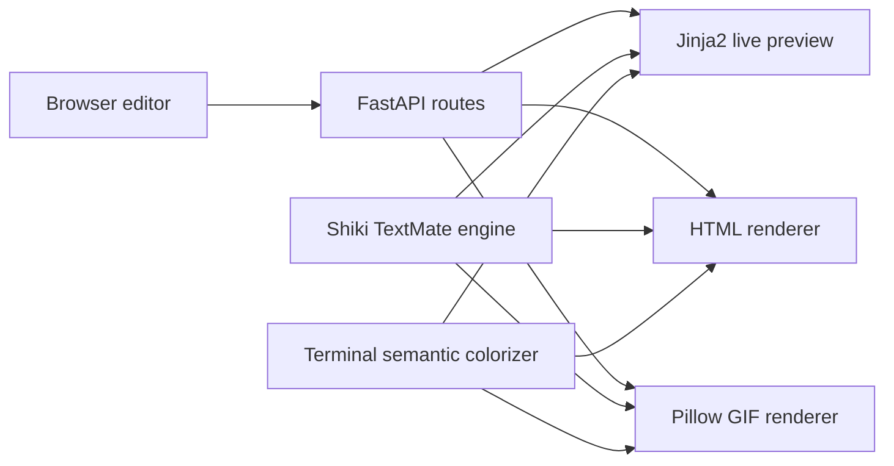

# Coduxum

Coduxum is a FastAPI web application for creating polished code-typing and terminal animations directly in the browser. It combines a configurable code editor, syntax-aware rendering, a macOS-style terminal simulator, live previews, and downloadable GIF or HTML output in one lightweight project.

The application contains two focused tools:

- **Code Studio** turns source code into a syntax-highlighted typing animation.
- **Terminal Studio** animates a command word by word, waits one second, and displays colorized terminal output at once.

> Terminal Studio is a visual simulator. It never executes the commands entered by the user.

## Screenshots

### Code Studio

Code Studio supports language-aware highlighting, file icons, multiple themes, configurable typing modes, line numbers, window chrome, cursor styles, playback controls, and common output dimensions.


### Terminal Studio

Terminal Studio recreates a macOS Terminal window at a fixed 700×300 export size. Commands are typed word by word, followed by a one-second pause and immediate output. Errors, warnings, success messages, paths, strings, diagnostics, and ANSI colors receive terminal-style coloring.


## Features

- Smooth HTMX navigation between Home, Code Typer, Code Diff, Code Scroll, and Terminal Studio without full-page reloads
- Browser history, URL updates, loading feedback, focus management, and view transitions for page swaps

### Code animation

- Live typing preview with restart and playback controls
- Character, syntax-token, word, and line typing modes
- Authentic Shiki / TextMate syntax highlighting with the original editor theme rules
- Built-in samples and a broad programming-language catalog
- Auto language detection from filename, then source; explicit language choices always win
- Multiple editor themes and monospaced font choices
- Adjustable typing speed, line pause, start delay, font size, and line height
- Configurable line numbers, window chrome, autoplay, loop, cursor style, and frame size
- Consistent 16:9 (1280x720) and 1:1 (1080x1080) code-video formats
- Offline standalone HTML, 60 fps MP4, 20 fps GIF, and reusable project JSON exports

### Code scroll animation

- Smooth camera movement that centers a selected line or line range
- Theme-derived focus fill and rail with surrounding-code dimming
- Real TextMate syntax colors in both the source editor and rendered animation
- Adjustable scroll duration, opening delay, focus hold, typography, canvas, and frame format
- Matching live preview, standalone HTML, GIF, MP4, and project JSON exports

### Terminal animation

- macOS-style title bar, traffic-light controls, prompt, command, cursor, and output
- Editable window title, prompt, command, and output
- Word-by-word command typing with adjustable speed
- Fixed one-second delay before output appears
- Semantic colors for errors, warnings, successful operations, paths, strings, numbers, and diagnostic markers
- Support for standard ANSI foreground colors in pasted output
- Optional looping
- Standalone HTML and exact 700×300 animated GIF exports

## How It Works


```mermaid
flowchart LR
    A["Browser editor"] --> B["FastAPI routes"]
    B --> C["Jinja2 live preview"]
    B --> D["HTML renderer"]
    B --> E["Pillow GIF renderer"]
    F["Shiki TextMate engine"] --> C
    F --> D
    F --> E
    G["Terminal semantic colorizer"] --> C
    G --> D
    G --> E
```

1. The browser collects the selected code or terminal settings.
2. HTMX navigation keeps the shared shell mounted and swaps only `#page-content`, while preserving normal URLs and browser history.
3. HTMX sends editor changes to FastAPI preview endpoints without reloading the page.
4. Page-specific JavaScript initializes after each swap, so both studios remain fully interactive.
5. The HTML renderer builds an isolated animation inside an iframe.
6. Export endpoints use the same settings to generate standalone HTML, JSON, or GIF files.
7. Pillow renders GIF frames server-side, so exported animations do not require a browser recording step.

## Technology Stack

| Technology | Purpose |
| --- | --- |
| **Python** | Application language and rendering logic |
| **FastAPI** | Web routes, form processing, and download responses |
| **Uvicorn** | ASGI development and production server |
| **Jinja2** | Server-rendered pages and iframe preview templates |
| **HTMX** | Partial-page navigation, history management, transitions, and live preview updates |
| **Tailwind CSS** | Responsive layout and interface styling |
| **CodeMirror 5** | Browser-based source-code editor |
| **Shiki + Node.js 20+** | Local TextMate grammars and unmodified editor theme rules |
| **Pygments** | Language guessing only; never assigns syntax colors |
| **Pillow** | Server-side animated GIF and screenshot rendering |
| **Vanilla JavaScript** | Typing timelines, controls, custom selects, and terminal playback |

## Run Locally

### 1. Clone the repository

```bash
git clone git@github.com:BlackCobra29-bit/Code-Typer-Studio.git
cd Code-Typer-Studio
```

### 2. Create a virtual environment

Windows PowerShell:

```powershell
py -m venv .venv
.\.venv\Scripts\Activate.ps1
```

macOS or Linux:

```bash
python3 -m venv .venv
source .venv/bin/activate
```

### 3. Install dependencies

```bash
pip install -r requirements.txt
npm ci
```

Node.js 20 or newer is required. Shiki is pinned in `package-lock.json`; all grammars and themes run locally, and source code is never sent to a highlighting service.

### 4. Start the application

```bash
uvicorn main:app --reload
```

Open these pages:

- Home: [http://127.0.0.1:8000](http://127.0.0.1:8000)
- Code Studio: [http://127.0.0.1:8000/code-typer](http://127.0.0.1:8000/code-typer)
- Code Diff: [http://127.0.0.1:8000/code-diff](http://127.0.0.1:8000/code-diff)
- Code Scroll: [http://127.0.0.1:8000/code-scroll](http://127.0.0.1:8000/code-scroll)
- Terminal Studio: [http://127.0.0.1:8000/terminal](http://127.0.0.1:8000/terminal)

## Using Code Studio

1. Open `/code-typer`, select a sample, or paste source code into the editor.
2. Choose the language, theme, filename, typing mode, speed, and frame size.
3. Review the live preview and use **Restart** to replay it.
4. Pause, replay, or scrub the timeline; export HTML, MP4, GIF, or project JSON.

## Using Code Scroll

1. Open `/code-scroll` and paste a long source file.
2. Select the language, theme, and first and last lines to highlight.
3. Tune the scroll duration, focus hold, typography, and frame format.
4. Replay or scrub the centered focus animation, then export HTML, MP4, GIF, or project JSON.

## Using Terminal Studio

1. Open `/terminal` from the navigation.
2. Set the terminal title and prompt.
3. Enter the command to animate and the output to display.
4. Adjust the word speed and enable looping when needed.
5. Export the animation as standalone HTML or a 700×300 GIF.

Terminal output can be plain text or contain ANSI foreground sequences. Plain text is colorized automatically from recognizable message types; explicit ANSI colors take priority when present.

## Application Routes

| Method | Route | Description |
| --- | --- | --- |
| `GET` | `/` | Landing page for all studios |
| `GET` | `/code-typer` | Code Studio page |
| `POST` | `/preview` | Refresh the code animation preview |
| `POST` | `/highlight` | Resolve original theme tokens for the source editor |
| `POST` | `/download/mp4` | Export a 60 fps code animation |
| `POST` | `/download/html` | Export a standalone code animation |
| `POST` | `/download/gif` | Export an animated code GIF |
| `POST` | `/download/project` | Export code settings as JSON |
| `GET` | `/code-diff` | Code Diff studio page |
| `POST` | `/code-diff/preview` | Refresh the animated diff preview |
| `POST` | `/code-diff/download/{format}` | Export diff HTML, GIF, MP4, or project JSON |
| `GET` | `/code-scroll` | Code Scroll studio page |
| `POST` | `/code-scroll/preview` | Refresh the scroll-to-line preview |
| `POST` | `/code-scroll/download/html` | Export a standalone scroll animation |
| `POST` | `/code-scroll/download/gif` | Export the scroll animation as GIF |
| `POST` | `/code-scroll/download/mp4` | Export the scroll animation as MP4 |
| `POST` | `/code-scroll/download/project` | Export scroll settings as JSON |
| `GET` | `/terminal` | Terminal Studio page |
| `POST` | `/terminal/preview` | Refresh the terminal animation preview |
| `POST` | `/terminal/download/html` | Export a standalone terminal animation |
| `POST` | `/terminal/download/gif` | Export a 700×300 terminal GIF |

## Project Structure

```text
.
|-- main.py                       # FastAPI application and routes
|-- requirements.txt              # Python dependencies
|-- README.md
|-- docs/
|   `-- images/                    # README screenshots
|-- src/
|   |-- gif_exporter.py            # Code animation GIF/MP4 renderer
|   |-- diff_renderer.py           # Code Diff model and HTML renderer
|   |-- diff_exporter.py           # Code Diff GIF/MP4 renderer
|   |-- scroll_renderer.py         # Code Scroll model and HTML renderer
|   |-- scroll_exporter.py         # Code Scroll GIF/MP4 renderer
|   |-- languages.py               # Language metadata and icon mappings
|   |-- renderer.py                # Code animation HTML renderer
|   |-- samples.py                 # Built-in code examples
|   |-- syntax_style.py            # Local Shiki worker bridge
|   |-- terminal_renderer.py       # Terminal HTML/GIF renderer and colorizer
|   `-- themes.py                  # Editor theme definitions
|-- static/
|   |-- app.js                     # Code Studio interactions
|   |-- diff_studio.js             # Code Diff interactions
|   |-- scroll_studio.js           # Code Scroll interactions
|   |-- code_studio.css            # Shared editor and transition styles
|   |-- shared.js                  # Shared navigation, history, and modal interactions
|   |-- terminal.js                # Terminal Studio interactions
|   `-- icons/                     # Language and file icons
`-- templates/
    |-- index.html                 # Landing page
    |-- code_typer.html            # Code Studio page
    |-- code_diff.html             # Code Diff studio page
    |-- code_scroll.html           # Code Scroll studio page
    |-- terminal.html              # Terminal Studio page
    |-- _base.html                 # Shared application shell and HTMX target
    |-- _head_assets.html          # Shared styles and browser dependencies
    |-- _scripts.html              # Shared HTMX, CodeMirror, and page scripts
    |-- _navigation.html           # Shared responsive navigation
    |-- _buy_me_coffee.html        # Shared support button
    |-- _shared_modals.html        # Terminal-page About and Contact modals
    |-- _preview.html              # Code preview iframe
    `-- _terminal_preview.html     # Terminal preview iframe
```

## Export Formats

- **HTML:** A standalone page containing the animation styles and playback logic.
- **GIF:** A server-rendered animated image suitable for documentation, social posts, and presentations.
- **Project JSON:** Code Studio content and settings for reuse or version control.

## Author

Developed by [tesfahiwet truneh](https://www.linkedin.com/in/%F0%90%A9%A9%F0%90%A9%AA%F0%90%A9%B0%F0%90%A9%A2%F0%90%A9%BA%F0%90%A9%A5%F0%90%A9%A9-%F0%90%A9%A9%F0%90%A9%A7%F0%90%A9%A5%F0%90%A9%AC%F0%90%A9%A0-2a2139179/).


## Highlighting and motion pipeline

`src/highlight.mjs` runs a warm, local Shiki worker. Its TextMate grammars process the **complete** source before animation; `src/syntax_style.py` carries the exact token colors and italic/bold/underline flags to CodeMirror, HTML, and Pillow. It does not assign category palettes, recolor parentheses, or invent semantic colors. Theme background, foreground, caret, and gutter colors come from the same theme definition. Unsupported languages render as plain text. Missing Shiki/Node dependencies produce a visible 503 error instead of silently substituting an approximate palette.

VS Code Dark+, Light+, Dracula, GitHub, One Dark Pro, and the other offered themes use Shiki's bundled upstream definitions. This matches **TextMate highlighting**, not language-server semantic highlighting or user-installed VS Code extensions. A theme may intentionally give different syntax categories the same color. Automatic detection is best-effort: filename wins over source guessing; select the language explicitly for ambiguous snippets.

Older theme names map to real themes: Dracula Glow → Dracula, Monokai Pro → Monokai, Light Studio → GitHub Light, Midnight Pro → Night Owl, and Synthwave → Synthwave '84. Other unknown legacy names fall back to Dark+.

`src/typing_timeline.py` calculates deterministic reveal times, faster whitespace, punctuation pauses, line transitions, opening delay, and a 1.5 second closing hold. HTML uses requestAnimationFrame only as a clock; `window.codeTyping.seek(milliseconds)` renders any timeline position. Text is prelaid out, and the absolutely positioned cursor never shifts the source. Scroll motion is seekable, and preview size scales the actual export canvas instead of changing its line height. Reduced-motion users get the completed frame on initial load and can opt into playback.

MP4 samples that timeline at **60 fps** and streams frames into H.264. It is no longer capped at 72 distinct frames. GIF samples at **20 fps**, uses a fixed palette, fits within 700×700, and only loops if requested. MP4 supports up to 3 minutes; GIF supports up to 45 seconds. The app displays a clear error for longer requests; HTML has no duration limit. Source input is limited to 20,000 characters, 1,000 lines, and 2,000 characters per line to bound render resources.

JetBrains Mono regular/bold/italic/bold italic are bundled under the SIL Open Font License (`static/fonts/OFL.txt`) and embedded in HTML exports. For the closest preview/video match, use this default family. Other font choices depend on fonts installed on the rendering host and can fall back to JetBrains Mono in video. HTML and Pillow share colors/timing but use different rasterizers; title-bar details, text antialiasing, and GIF palette quantization can differ. Playback controls are outside the scene and never appear in GIF/MP4.

## Verification

```bash
python -m unittest discover -s tests -v
```

Coverage includes upstream Dark+/Dracula token colors, all offered themes/languages, automatic detection and manual overrides, multiline/Unicode/whitespace preservation, safe HTML serialization, deterministic timing, scrolling, and GIF loop behavior.

Design benchmark: [Hyperframes Code Typing](https://hyperframes.heygen.com/catalog/blocks/code-typing). The studio keeps its own implementation and visual treatment. Theme engine reference: [Shiki](https://shiki.style/guide/install).
